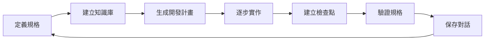

# 完整工作流程

使用 Kiro CLI 進行規格驅動開發的完整流程。

## 開發循環



## 詳細步驟

### 1. 定義規格

在 `docs/spec.md` 撰寫專案規格：

```markdown
# 用戶管理 API

## 功能需求
- [ ] 用戶註冊
- [ ] 用戶登入
- [ ] 取得用戶資訊

## API 設計
POST /api/auth/register
POST /api/auth/login
GET  /api/users/:id
```

**關鍵點**：
- 明確定義功能範圍
- 包含技術細節
- 可測試、可驗證

### 2. 建立知識庫

啟動 Kiro CLI 並索引專案文件：

```bash
# 啟動 Kiro CLI
kiro-cli chat

# 啟用實驗性功能
/experiment

# 建立知識庫
/knowledge add --name docs --path docs/
/knowledge add --name src --path src/
```

**作用**：
- 讓 Kiro 理解專案脈絡
- 快速搜尋相關資訊
- 保持上下文一致性

### 3. 生成開發計畫

與 Kiro 對話，生成 TODO 清單：

```
> 根據 docs/spec.md 建立開發計畫
```

Kiro 會分析規格並生成：

```
TODO List:
[ ] 1. 設計資料庫 schema
[ ] 2. 實作用戶註冊 API
[ ] 3. 實作用戶登入 API
[ ] 4. 實作 JWT 認證中介層
[ ] 5. 撰寫 API 測試
```

**優勢**：
- 自動拆解任務
- 合理的執行順序
- 可追蹤進度

### 4. 逐步實作

按照 TODO 清單逐項開發：

```
> 開始實作第一個任務：設計資料庫 schema
```

Kiro 會：
1. 讀取規格中的資料模型定義
2. 生成資料庫遷移檔案
3. 建立 ORM 模型
4. 標記任務完成

**工作方式**：
- 一次專注一個任務
- 完成後自動標記
- 保持程式碼品質

### 5. 建立檢查點

在重要節點建立檢查點：

```
/checkpoint create "完成用戶註冊功能"
```

**用途**：
- 記錄開發里程碑
- 方便回溯變更
- 比較不同版本

查看檢查點：
```
/checkpoint list
/checkpoint diff v1 v2
```

### 6. 驗證規格

確認實作符合規格要求：

```
> 驗證目前的實作是否符合 spec.md 的要求
```

Kiro 會檢查：
- ✓ 所有功能是否實作
- ✓ API 端點是否正確
- ✓ 資料模型是否一致
- ✓ 測試覆蓋率

### 7. 保存對話

保存開發過程：

```
/save "用戶管理 API 開發"
```

**好處**：
- 記錄決策過程
- 方便日後查閱
- 團隊知識共享

載入之前的對話：
```
/load
```

## 實際範例

### 場景：開發用戶註冊功能

```bash
# 1. 定義規格（已完成）

# 2. 啟動 Kiro
kiro-cli chat

# 3. 建立知識庫
/knowledge add --name docs --path docs/

# 4. 生成計畫
> 根據 spec.md 實作用戶註冊功能

# 5. Kiro 生成 TODO
[ ] 建立 User 資料模型
[ ] 實作密碼加密
[ ] 建立註冊 API 端點
[ ] 撰寫驗證邏輯
[ ] 加入錯誤處理
[ ] 撰寫測試

# 6. 逐步實作
> 開始第一個任務

# 7. 建立檢查點
/checkpoint create "完成用戶註冊"

# 8. 保存對話
/save "用戶註冊開發"
```

## 進階技巧

### 使用 Tangent Mode

處理臨時問題時使用 Tangent Mode（Ctrl+T）：

```
Ctrl+T  # 進入 Tangent Mode
> 如何在 Express 中處理檔案上傳？
Ctrl+T  # 退出，回到主要任務
```

### Agent 配置

建立專案專用的 agent 配置（`.kiro/agents/project-dev.json`）：

```json
{
  "name": "project-dev",
  "description": "專案開發 agent",
  "instructions": "遵循 docs/spec.md 的規格進行開發"
}
```

### 知識庫搜尋

搜尋專案知識：

```
/knowledge search "用戶認證"
```

## 常見問題

**Q: 規格變更時怎麼辦？**  
A: 更新 `spec.md`，然後重新生成開發計畫

**Q: 如何處理大型專案？**  
A: 將規格拆分成多個檔案，分別索引到知識庫

**Q: TODO 清單太長怎麼辦？**  
A: 可以手動調整，或請 Kiro 重新規劃優先順序

## 下一步

- 查看[實際範例](/docs/examples/user-api)
- 學習[最佳實踐](/docs/best-practices)
- 了解[命令參考](/docs/commands)
